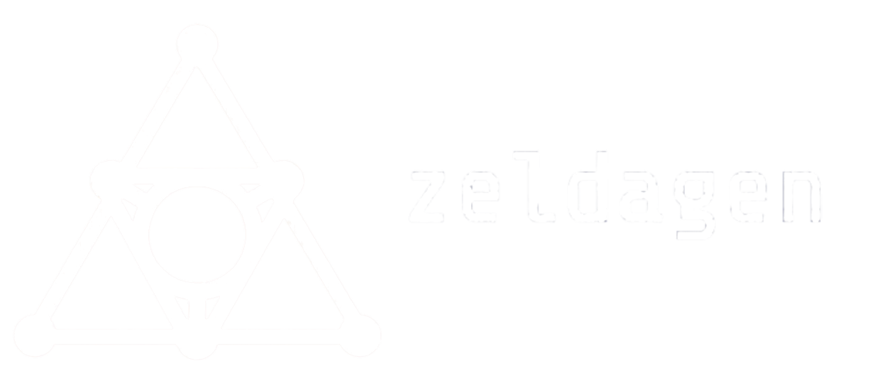

**Zeldagen** is a procedural Zelda-like dungeon generation project, utilizing genetic algorithms. The name "Zeldagen" combines "gen" from both **generative** and **genetic**.

It was built as a project for the course "Fundamentals of Artificial Intelligence" of the Computer Science faculty, Università degli Studi di Salerno.

## Key idea

The idea behind Zeldagen stems from the challenge of creating high-quality gameplay experiences like those found in The Legend of Zelda series. These games have captivated millions due to their well-balanced and rewarding dungeon designs. However, achieving such balance and challenge in procedural generation is difficult without human design.

In most games that use procedural generation, there is a compromise between **variety vs. quality**. To provide fresh and non-repetitive experiences, the generated content often sacrifices quality. Zeldagen aims to solve this issue by generating dungeons that are not only diverse but also satisfying for players.

## Goal and approach

The goal of Zeldagen is to generate Zelda-like dungeon topologies that are procedurally created yet still feel rewarding and challenging for human players. The goal is to produce them quickly, without compromising quality.

To achieve this, we decided to use an **intelligent agent** in the form of a genetic algorithm. Genetic algorithms are ideal for optimization, allowing for iterative improvements and refinements to the generated dungeons.

## How it works

More information about Zeldagen and how it works can be found in the documentation, in the [docs/zeldagen.pdf](docs/zeldagen.pdf) file, in italian language.

## File structure

The `src` folder contains the executable source code for three things:
- the genetic algorithm itself (executable through [main.py](./src/main.py));
- the benchmarks for the genetic algorithm (executable through [benchmark.py](./src/benchmark.py));
- the demo (executable through [demo.py](./src/demo/demo.py)).

The [constants.py](./src/constants.py) file contains different constants used throghout the algorithm to easily change them, such as the number of rooms of a dungeon and the room types enum.

The [dungeon.py](./src/dungeon.py) file is part of the genetic algorithm and represents an individual, containing the code for initialization, fitness calculation and printing the graph.

The `demo` folder also contains a [demo_styles.tcss](./src/demo_styles.tcss), used by the `Textual` Python library to apply style to the demo TUI application.

---
The `docs` folder contains the documentation report as a PDF file [zeldagen.pdf](./docs/zeldagen.pdf), with its relative [LaTeX](https://www.latex-project.org/) document [zeldagen.tex](./docs/zeldagen.tex).  
There's also the [bibliography.bib](./docs/bibliography.bib) file which is used by [BibTeX](https://bibtex.eu/) to create the bibliography paragraph.  

The `docs/assets` folder contains multiple images used in the documentation report.

## How to run it

To run the project, you'll have to install [Python 3.10.6](https://www.python.org/downloads/release/python-3106/) and [Graphviz 12.2.1](https://graphviz.org/download/), then install all packages in [requirements.txt](requirements.txt) through pip.  

If you only want to run the [genetic algorithm](./src/main.py) or the [benchmarks](./src/benchmark.py), you don't need to install anything else and can simply run them through the virtual environment with the Python interpreter.

If you want to run the [demo](./src/demo/demo.py), you'll have to make sure that your machine can handle [Ollama](https://github.com/ollama/ollama) flawlessly.
If this is the case, proceed to install Ollama. Then, you can simply run the demo's terminal user interface by running the `demo.py` file with your Python interpreter, after activating the virtual environment.  
**Note:** you'll have to run the file from inside the  `src/demo` folder. The working directory path is important.

## Contacts

If you have issues running the project or want more informations, you can send me a mail at [danieledemartino.72004@gmail.com](mailto:danieledemartino.72004@gmail.com), or open an issue in this repository.

## License

This project is licensed under the GNU License - see the [LICENSE](LICENSE) file for details.